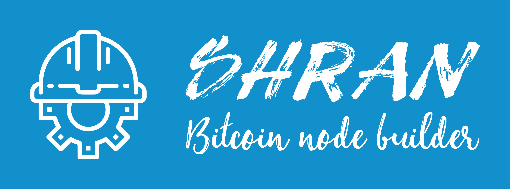

<div align="center">
  
</div>

<br>

<div align="center">
  <a href="https://github.com/mattcoding4days/Shran/actions/workflows/rust.yml">
    
  </a>
  <a href="https://codecov.io/gh/mattcoding4days/Shran">
    
  </a>
  
  
  
  
  
  
</div>

### :information_source: Automate Bitcoin builds, speed up deployment

  Shran is an open-source cli tool being developed to address the needs of [DMG Blockchain Solutions](https://dmgblockchain.com/).
  It supports build configurations through a yaml file. Customizing a Bitcoin node with
  your own .so libraries, while avoiding the need to deal directly with the automake build system
  is made extremely simple. It's so easy, your dev ops team with no C++ experience can carry out builds,
  tests, and deployments.

### :building_construction: Development

  The tool is written in Rust, so compiling and testing is simple
  
```bash
# Compile the source
cargo build

# Run the tests
cargo test

# Run the debug version
./target/debug/shran --help
```

### :superhero_man: Features

> :warning: Shran is currently under heavy development

#### Current planned features

  * [x] cli design
  * [ ] Github Api integration
  * [ ] Docker integration
  * [ ] Github action integration
  * [ ] Vanilla and Custom builds supported through a yaml file

### :keyboard: Usage ( Not complete )

```bash
shran 0.1.0
Matt Williams matt@dmgblockchain.com
A command line tool for automating the process of building and deploying a Bitcoin node

USAGE:
    shran [OPTIONS]

FLAGS:
    -h, --help       Prints help information
    -V, --version    Prints version information

OPTIONS:
    -b, --build-file <build-file>    Path to a `bitcoin-build.yaml` file
```

### :scroll: Documentation ( Not complete )


### :mage: Contributing ( Not complete )
